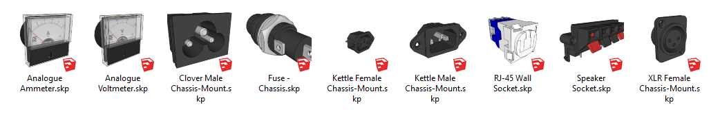
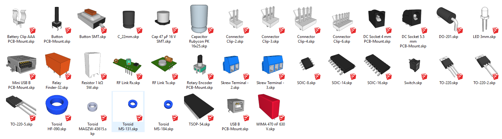
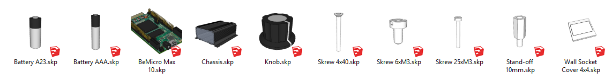

# SketchUp Toolbox

A collection of SketchUp models.  They are drawn, from scratch, following either the component data-sheet, physical measurements, or both.

## Chassis-Mount

## PCB-Mount

## Miscellaneous

----------------

 This work is licensed under a <a rel="license" href="http://creativecommons.org/licenses/by-sa/4.0/">Creative Commons Attribution-ShareAlike 4.0 International License</a>.

